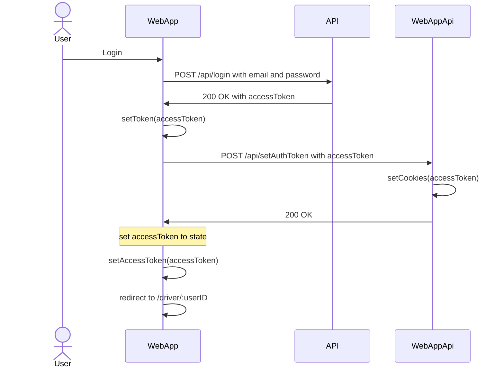

```mermaid
sequenceDiagram
    actor User
    participant A as WebApp 
    
    User->>A: Login
    A->>API: POST /api/login with email and password
    API->>A: 200 OK with accessToken
    A->>A: setToken(accessToken)
    A->>WebAppApi: POST /api/setAuthToken with accessToken
    WebAppApi->>WebAppApi: setCookies(accessToken)
    WebAppApi->>A: 200 OK
    note over A: set accessToken to state
    A->>A: setAccessToken(accessToken)
    A->>A: redirect to /driver/:userID
```
